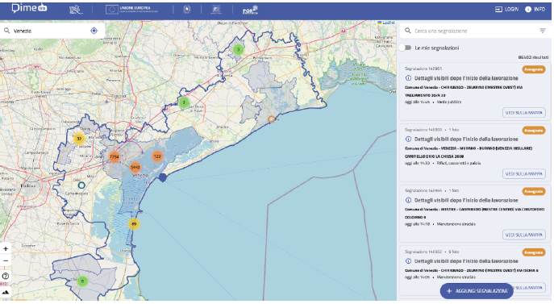
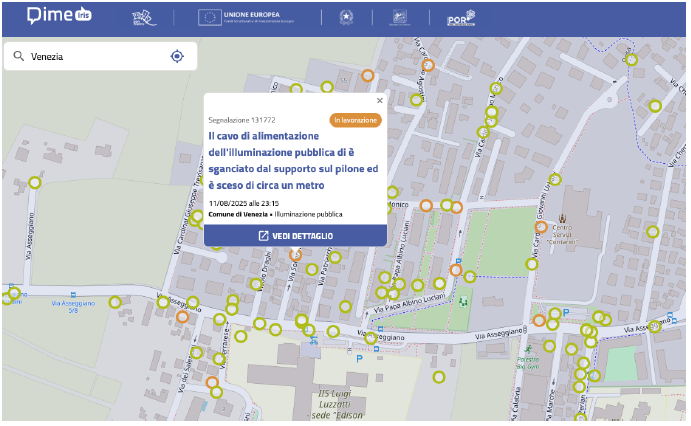

# Participium

## Purpose and Context
**Participium** is a citizen-participation web system for the Municipality of Turin. Its goal is to provide a structured and transparent channel through which citizens can report urban issues (e.g., potholes, broken streetlights, waste on streets, architectural barriers) and monitor how these reports are handled over time with a responsive web application.

The system is conceived as an **open-source** solution that can be adopted by other public administrations. A comparable real-world platform is **[IRIS](https://iris.sad.ve.it/)** (Venice).

---

## Core Concept
The central object managed by Participium is a **Report**: a geo-located issue submitted by a registered citizen, enriched with textual information, a category, and a small set of photos. Reports are published on a city map and can be searched, filtered, and tracked as they progress through municipal handling.

Participium aims to balance:
- **Public transparency** (citizens can see what has been reported and what is being addressed),
- **Operational support** (municipal offices can organize and manage incoming reports),
- **Communication** (citizens receive updates and can interact with operators).

---

## Users and Roles
Participium supports multiple kinds of users. Visitors can access the public portal for consultation. Registered citizens can submit reports, track their evolution, and interact with the municipality. Municipal offices are responsible for reviewing incoming submissions and managing accepted reports according to internal responsibilities (typically including an initial verification function and technical offices in charge of interventions). System administrators manage configuration aspects and access extended analytics.

---

## Registration and Citizen Profile
To submit a report, users must create a citizen account by providing basic identity information (username, first name, last name) and confirming their email address through a verification link.

Citizens can manage preferences such as:
- whether to receive **email notifications** in addition to in-platform notifications,
- optionally a profile picture.

---

## Report Submission
A report is created by a registered citizen through an interactive workflow centered on the city map.

### Geo-location
The citizen selects a position on an **OpenStreetMap-based** map of Turin. The location is stored as **latitude/longitude** and is the primary reference for visualizing the issue on the map.

### Content and Attachments
Each report includes:
- a **title** and a **textual description**,
- a **category** selected from a predefined set,
- **one or more photos**, up to a maximum of **3**.

### Public Anonymity Option
A citizen may mark a report as **anonymous** for public views. In that case, the report is published and trackable, but the reporter’s identity is not shown to the public.

---

## Report Status
Each report is associated with a **finite set of statuses** that summarize its current condition within municipal handling:
- **Pending Approval**
- **Assigned**
- **In Progress**
- **Suspended**
- **Rejected**
- **Resolved**

Statuses are used to communicate whether a report is still under initial review, has been routed to the competent office, is being addressed, is temporarily paused, has been rejected (with an explicit motivation), or has been closed after resolution.

---

## Categories
Reports are classified by category to support routing, filtering, and statistics. The categories defined in the initial specification include:
- Waterworks – Drinking Water
- Architectural Barriers
- Sewerage
- Public Lighting
- Waste
- Road Signs and Traffic Lights
- Roads and Urban Furniture
- Public Green Areas and Playgrounds
- Other

---

## Public Consultation: Map and Table Views
Participium provides a public-facing portal for browsing published reports.

### Map View
Reports are displayed on the map as geo-located items. Users can explore the city visually and access the corresponding report details by selecting a report from the map.

### Table View
Reports are also accessible in a structured list supporting:
- filtering by category and status,
- filtering by time period,
- sorting by relevant fields (e.g., date).

### Export
The table view supports exporting results in **CSV** format for transparency, offline analysis, or sharing.

---

## Report Details Page
A report detail view presents the complete content of a report, typically including:
- title, description, category,
- location (shown on the map),
- attached photos,
- current status and available updates.

The detail view is the reference point for both citizens and municipal staff to understand the issue and follow updates.  
Authenticated citizens can **follow** a report (including reports submitted by other citizens) in order to receive updates about its evolution. Followers receive the same kind of updates (notifications and, optionally, emails) as the original reporter.

---

## Notifications and Communication
A key goal of Participium is to improve citizen trust through clear communication.

### Status Updates
When a report changes status during municipal handling, the system generates **in-platform notifications** for the reporting citizen and for citizens who have chosen to **follow** the report.

### Optional Email Notifications
Each in-platform notification can also be sent by **email**, unless the user disables this option in their profile.

### Messaging
Participium supports **direct messaging** between citizens and municipal operators:
- operators can request clarifications or provide updates,
- citizens can reply through the platform.

Messaging is conceived as a first-class communication channel.

---

## Statistics and Reporting
Participium includes analytics features for both transparency and internal management.

### Public Statistics
Public statistics are visible on the site and are accessible also to **unregistered users**. They include:
- number of reports by **category**,
- trends over time, aggregated by **day**, **week**, or **month**.

### Private Statistics
Private statistics are available to **administrators only**. In addition to the public statistics, they include charts and tables about:
- number of reports by **status**,
- number of reports by **type**,
- number of reports by **type and status**,
- number of reports by **reporter**,
- number of reports by **reporter and type**,
- number of reports by **reporter, type, and status**,
- number of reports submitted by the **top 1% of reporters**, by type,
- number of reports submitted by the **top 5% of reporters**, by type.