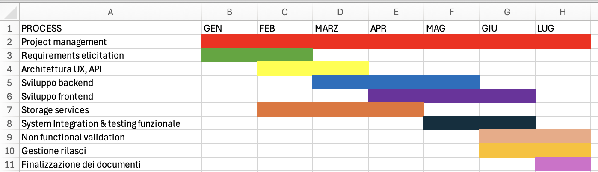

# Product Breakdown Structure (PBS)

| ID | Deliverable | Type  | Notes |
|:---|:------------|:--------------------------------------------------|:------|
| S1 | Applicazione Web (UI + clienti)           |   Software                                               |       |
| S2 | API Getway / BFF           |   Software  
| S3 | Registrazione / Autenticazione          |   Software  
| S4 | Servizi utenti / amministratore         |   Software  
| S5 | Notifications, Messaging & Follow System       |   Software  
| S6 | Vista mappa cittadina         |   Software  
| S7 | Vista tabellare         |   Software  
| S8 | Ricerca / Discovery        |   Software  
| S9 | Esportazione dati CSV       |   Software  
| S10 | Gestione segnalazioni (Report Management) | Software | Creazione segnalazioni, Workflow stati segnalazioni, Dettaglio segnalazione
| S11 | Statistiche analitiche     |   Software 
| I1 | Database     |   Infrastrutture 
| I2 | Object storage (immagini)     |   Infrastrutture 
| I3 | Mail Server (SMTP) | Infrastrutture 
| I4 | Backup | Infrastrutture 
| I5 | Pipeline CI/CD & repo (git, ...) | Infrastrutture 
| I6 | Metrics, Logging & Monitoring | Infrastrutture |
| I7 | Map Service (OpenStreetMap) | Infrastrutture |
| D1 | Documento di visione e scopo | Documentazione |
| D2 | Documento di specifica dei requisiti | Documentazione |
| D3 | Documento di progettazione architetturale | Documentazione |
| D4 | Documento di specifiche API | Documentazione |
| D5 | Strategie e piano di test | Documentazione |
| D6 | Documento di deployment e gestione operativa | Documentazione |
| D7 | Manuale utente | Documentazione |
| D8 | Manuale amministratore | Documentazione |
| D9 | Sicurezza/ Privacy e Legale | Documentazione |
| D10 | Pianificazione progetto | Documentazione |
---

# Work Breakdown Structure (WBS)

### WBS with traceability to PBS
| ID  | Work package | Traced PBS outputs (IDs) |
|:----|:-------------|:--------------------------|
| 1 | Project management | D1-D10
| 2 | Requirements elicitation | D1, D2
| 3 | Architettura UX, API | D3, S2, D4
| 4 | Sviluppo backend | I1, S2, S3, S4, S5, S8, S10, S11, I6
| 5 | Sviluppo frontend | S1, S6, S7, S8, S10, S11
| 6 | Storage services | S9, I2, I3, I6, I7, I4
| 7 | System Integration & testing funzionale | D5
| 8 | Non functional validation | D5, D9
| 9 | Gestione rilasci | D6, D7, D8, I5
| 10 | Finalizzazione dei documenti | D3, D4, D6, D7, D8, D9, D10

---

# Gantt, dependencies, and critical path

## Activity table
| ID | Activity | Duration | Dependencies | Start | End | Critical | Milestone |
|:---|:---------|:---------|:-------------|:------|:----|:------|:---------|
| 1 | Project management | 7 Mesi         |    D1-D10          | Gennaio      | Luglio    |       |          |
| 2 | Requirements elicitation | 2 Mesi         |    D1, D2          | Gennaio      | Febbraio    |       |          |
| 3 | Architettura UX, API | 2 Mesi         |   D3, S2, D4         | Febbraio      | Marzo    |       |          |
| 4 | Sviluppo backend  | 3 Mesi         |   I1, S2, S3, S4, S5, S8, S10, S11, I6        | Marzo      | Maggio    |       |          |
| 5 | Sviluppo frontend  | 3 Mesi         |   S1, S6, S7, S8, S10, S11       | Aprile      | Giugno    |       |          |
| 6 | Storage services  | 3 Mesi         |   S9, I2, I3, I6, I7, I4       | Febbraio      | Aprile   |       |          |
| 7 | System Integration & testing funzionale  | 2 Mesi         |   D5     | Maggio      | Giugno   |       |          |
| 8 | Non functional validation  | 2 Mesi         |   D5, D9     | Giugno      | Luglio   |       |          |
| 9 | Gestione rilasci  | 2 Mesi         |   D6, D7, D8, I5     | Giugno      | Luglio   |       |          |
| 10 | Finalizzazione dei documenti | 1 Mese         | D3, D4, D6, D7, D8, D9, D10     | Luglio      | Luglio   |       |          |

Diagramma di Gantt

## Critical path
`X → X → X → ...`

---

# Risk Management

**Scales and thresholds**
- **Probability (P)**: 1 (rare) … 5 (almost certain)
- **Impact (I)**: 1 (minor) … 5 (critical)
- **Exposure**: `P × I` (range 1–25)

Risk level thresholds (by exposure):
- **Low**: 1–5
- **Medium**: 6–10
- **High**: 11–16
- **Very High**: >16

## Risks table
| ID | Risk | Category | P | I | P×I | Level | Mitigation / Response strategy |
|:---|:-----|:---------|--:|--:|----:|:------|:-------------------------------|
|  |      |          |   |   |     |       |                                |

