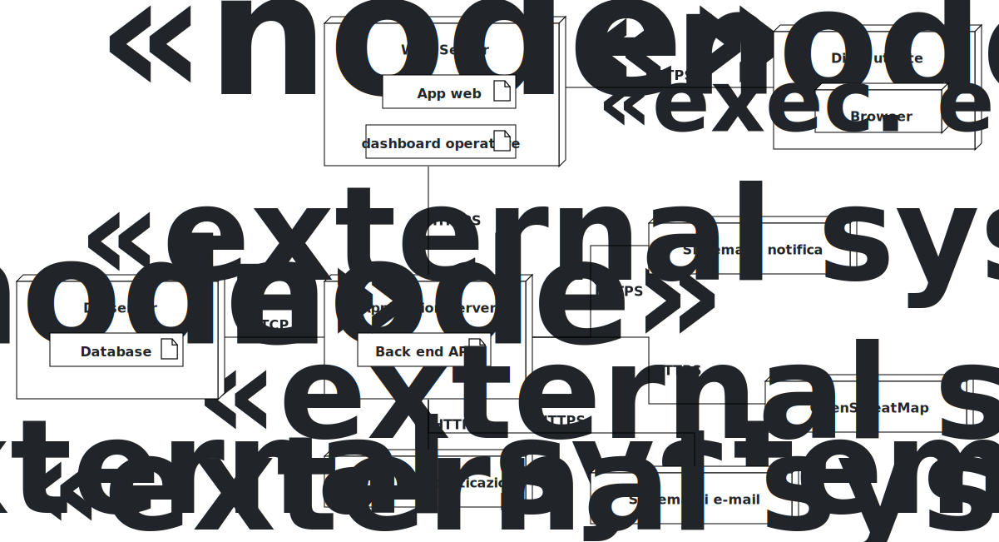

# 1) Glossary / Class Diagram

**Note sul Class Diagram.** La classe `CambioStato` non è ridondante rispetto all'attributo `stato` su `Segnalazione`: se bastasse registrare lo stato corrente con una nota, entrambi potrebbero essere attributi diretti di `Segnalazione`. La classe separata serve a supportare più transizioni nel tempo, ciascuna con il proprio timestamp e nota opzionale, rendendo possibile ricostruire l'intera sequenza di aggiornamenti richiesta da FR-18. Il flag `anonima` è mantenuto come attributo della segnalazione anziché rimuovere l'associazione con il cittadino: la dissociazione completa impedirebbe qualsiasi attività di moderazione, mentre così il sistema può garantire l'anonimato pubblico pur conservando internamente la tracciabilità necessaria agli operatori. Analogamente, `Cittadino.bannato` è un soft-ban: cancellare l'account invaliderebbe tutte le segnalazioni già accettate, che devono restare visibili e gestibili indipendentemente dall'utente che le ha create. `Admin` è modellato come classe separata e senza attributi propri perché le sue credenziali e la sua identità sono interamente delegate al servizio di autenticazione esterno — Participium non gestisce password di nessun tipo. `StatistichePubbliche` e `StatistichePrivate` compaiono nel diagramma non come entità persistite ma come contratto esplicito delle proiezioni calcolate esposte dall'API: la separazione tra le due classi riflette il confine di visibilità tra utenti non autenticati e amministratori, che è un vincolo architetturale e non solo di presentazione.

---

# 2) Deployment Diagram

**Note sul Deployment Diagram.** I tre artefatti front-end (App web, dashboard operatore, dashboard Admin) sono pacchetti separati anziché un'unica applicazione con routing per ruolo: questo limita la superficie esposta a ciascun tipo di utente e consente di aggiornare o ridistribuire un solo front-end senza toccare gli altri. L'API Gateway / BFF e il Back end API risiedono nello stesso Application server: l'API Gateway funge da unico punto di ingresso per tutti i client, gestendo il routing delle richieste verso il Back end API, mentre quest'ultimo contiene la logica applicativa e il controllo degli accessi per ruolo. Questa collocazione nello stesso nodo riflette la scelta di non introdurre un layer infrastrutturale separato, coerentemente con la scala del sistema e con il vincolo di deployability on-premise. La scelta di delegare autenticazione, email e notifiche a servizi esterni è coerente con la decisione, già documentata nei requisiti, di non conservare mai le credenziali degli utenti in Participium: il sistema non implementa alcun meccanismo di login proprio, e questa responsabilità è separata fin dal livello architetturale. OpenStreetMap è richiamato direttamente dal front-end senza passare per il Back end, evitando di fare del server applicativo un proxy per dati pubblici che il browser può ottenere direttamente.
