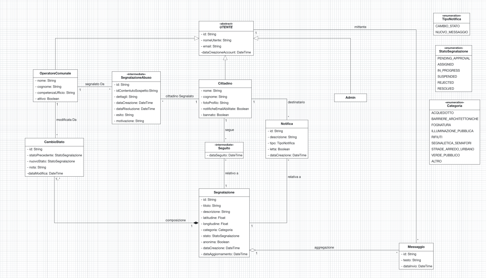

# 1) Glossary / Class Diagram

---

# 2) Deployment Diagram

Attach your deployment diagram as an image under `../data/img/` and link it here:

- ``

Also, make sure to include the JSON source file downloaded from the UML Modeler used to draw the diagram in the `../data/` folder (for example `deployment-diagram.json`).
