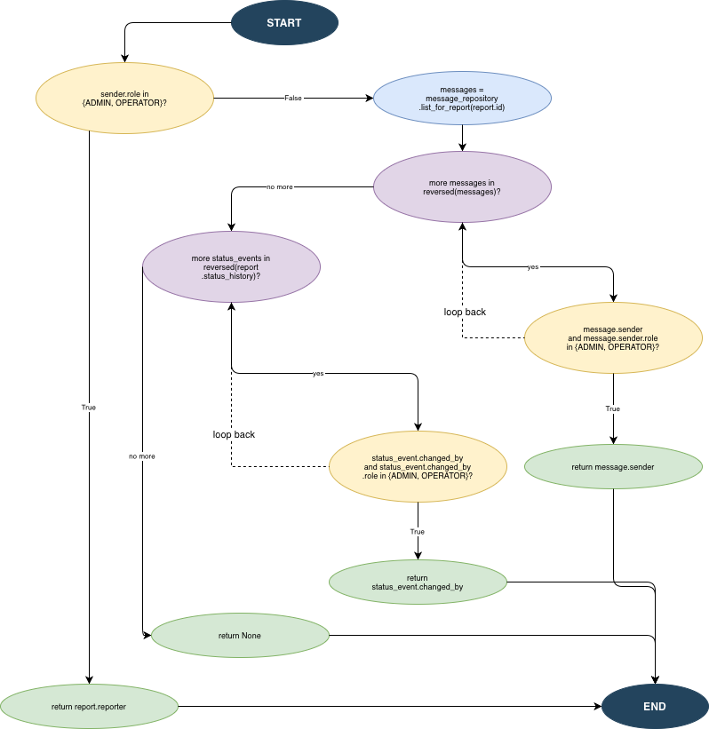
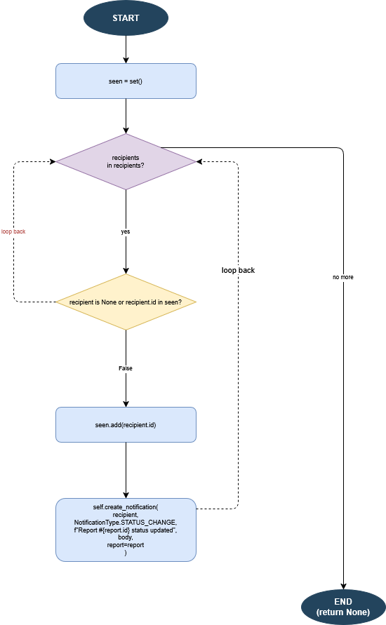
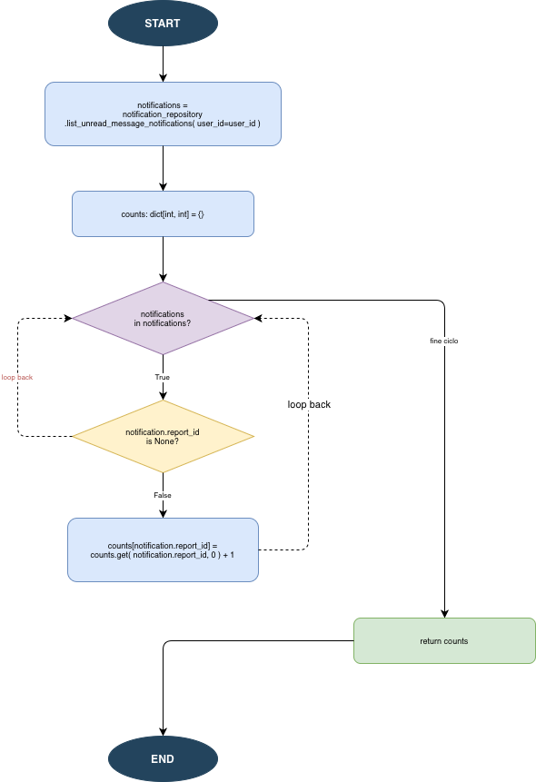
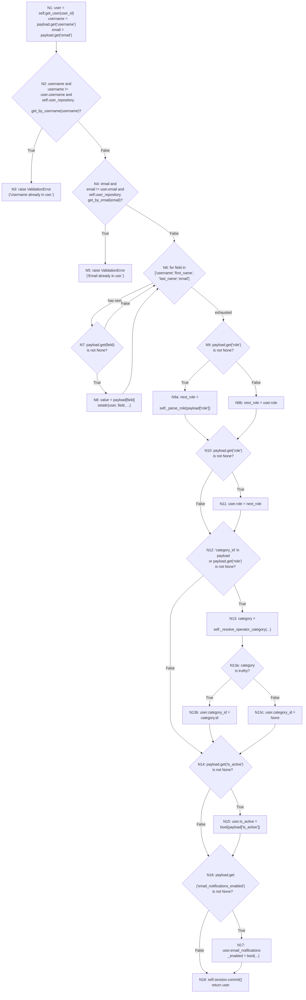

## 1 `ReportService.create_report`

### Control Flow Graph

- 

### Atomic Conditions

### Structural Lower Bound

### Node Coverage

### Edge Coverage

### Condition Coverage

### Loop Coverage

### Path Coverage

### Minimal Suite Test

## 2 `MessagingService._resolve_recipient`

### Control Flow Graph

### Atomic Conditions

- **C1**: `sender.role in {Role.ADMIN, Role.OPERATOR}`
- **C2a**: `message.sender` (truthy) — primo operando di `and`
- **C2b**: `message.sender.role in {Role.ADMIN, Role.OPERATOR}` — secondo operando di `and`, combinato tramite `and`
- **C3a**: `status_event.changed_by` (truthy) — primo operando di `and`
- **C3b**: `status_event.changed_by.role in {Role.ADMIN, Role.OPERATOR}` — secondo operando di `and`, combinato tramite `and`

### Structural Lower Bound

- **Nodi**: 12
- **Archi**: 16
- **Complessità ciclomatica**: V(G) = E − N + 2 = 16 − 12 + 2 = **6**
- **Nodi terminali distinti**: 4 (`return report.reporter`, `return message.sender`, `return status_event.changed_by`, `return None`)
- **Loop**: 2 (Loop 1 su `reversed(messages)`, Loop 2 su `reversed(report.status_history)`)

### Node Coverage

**4 test**

I 4 nodi terminali si trovano su percorsi mutualmente esclusivi, quindi nessun singolo test può coprirli tutti: il lower bound è **4 test**.

| Test | `sender` | `messages` | `status_history` | `Nodi attraversati` | Outcome |
|------|----------|------------|------------------|---------------------|--------------------------|
| N1 | ADMIN/OPERATOR | — | — | Ingresso, C1 (True) → `return report.reporter` | `return report.reporter` |
| N2 | CITIZEN | [msg con `sender` ADMIN] | — | Ingresso, C1 (False), fetch messages, Loop1 (C2a True, C2b True) → `return message.sender` | `return message.sender` |
| N3 | CITIZEN | `[]` | [event con `changed_by` ADMIN] | Ingresso, C1 (False), fetch messages, Loop1 (esausto), Loop2 (C3a True, C3b True) → `return status_event.changed_by` | `return status_event.changed_by` |
| N4 | CITIZEN | `[]` | `[]` | Ingresso, C1 (False), fetch messages, Loop1 (esausto), Loop2 (esausto) → `return None` | `return None` |

### Edge Coverage

**4 test**

I back-edge dei loop (iterazione senza match) non sono coperti dalla suite di node coverage: N4 viene sostituito da E4, che forza entrambe le iterazioni senza match. Il lower bound rimane **4 test**.

| Test | `sender` | `messages` | `status_history` | Archi coperti |
|------|----------|------------|------------------|---------------|
| E1 | ADMIN/OPERATOR | — | — | ingresso→C1 (True)→`return report.reporter` |
| E2 | CITIZEN | [msg con `sender` ADMIN] | — | ingresso→C1 (False)→fetch→Loop1→C2a (T)→C2b (T)→`return message.sender` |
| E3 | CITIZEN | `[]` | [event con `changed_by` ADMIN] | C1 (False)→fetch→Loop1 (esausto)→Loop2→C3a (T)→C3b (T)→`return status_event.changed_by` |
| E4 | CITIZEN | [msg con `sender` non-ADMIN] | [event con `changed_by` non-ADMIN] | C2b (F)→Loop1 (back-edge), C3b (F)→Loop2 (back-edge), Loop2 (esausto)→`return None` |

### Condition Coverage

**5 test**

C2 e C3 contengono ciascuna un `and` composto, rendendo lo short-circuit rilevante: C2b è valutata solo se C2a=True; C3b solo se C3a=True. Coprire C2a=False e C3a=False richiede un test aggiuntivo C5t non presente nelle suite precedenti. Il lower bound è **5 test** in entrambe le convenzioni.

| Test | `sender` | `messages` | `status_history` | C1 (`sender` ADMIN/OP) | C2a (`message.sender` truthy) | C2b (`sender.role` ADMIN/OP) | C3a (`changed_by` truthy) | C3b (`changed_by.role` ADMIN/OP) |
|------|----------|------------|------------------|------------------------|-------------------------------|------------------------------|---------------------------|----------------------------------|
| C1t | ADMIN/OPERATOR | — | — | T | — | — | — | — |
| C2t | CITIZEN | [msg con `sender` ADMIN] | — | F | T | T | — | — |
| C3t | CITIZEN | `[]` | [event con `changed_by` ADMIN] | F | — | — | T | T |
| C4t | CITIZEN | [msg con `sender` non-ADMIN] | [event con `changed_by` non-ADMIN] | F | T | F | T | F |
| C5t | CITIZEN | [msg con `sender=None`] | [event con `changed_by=None`] | F | F | — | F | — |

### Loop Coverage

**4 test (0, 1, 2+)**

| Test | `messages` | `status_history` | Loop 1 (iterazioni) | Loop 2 (iterazioni) | Note |
|------|------------|------------------|---------------------|---------------------|------|
| L0 | `[]` | `[]` | 0 | 0 | Entrambi i loop saltati (liste vuote) |
| L1a | [1 msg, `sender` ADMIN] | — | 1 | — | Loop1 termina con match al primo elemento; Loop2 non raggiunto |
| L1b | `[]` | [1 event, `changed_by` ADMIN] | 0 | 1 | Loop1 esaurito senza match; Loop2 termina con match al primo elemento |
| L2+ | [2 msg, `sender` non-ADMIN] | [2 event, `changed_by` non-ADMIN] | 2+ | 2+ | Entrambi i loop eseguiti 2+ volte senza match |

Loop 2 è raggiungibile solo quando Loop 1 si esaurisce senza match. L2+ è il solo test aggiuntivo rispetto alle suite precedenti. Il lower bound è **4 test**.

### Path Coverage

**Infinito**

I due loop iterano su liste di lunghezza arbitraria, e all'interno di ciascuno il corpo presenta 2 rami (match trovato → early return; nessun match → iterazione successiva). Il numero di percorsi distinti cresce esponenzialmente con la lunghezza degli input e il totale è numerabilmente infinito.

**Approssimazione**
Quando il CFG contiene loop il cui numero di iterazioni dipende dall'input, la path coverage stretta è irraggiungibile. Si procede trattando ogni loop come blocco 0/≥1 iterazioni, ottenendo 5 percorsi strutturalmente distinti: C1=True; C1=False con entrambe le liste vuote (Loop1 e Loop2 non entrano); C1=False con Loop1 che trova match prima di scorrere tutti i messaggi; C1=False con Loop1 che scorre tutti i messaggi senza match e Loop2 che trova match; C1=False con Loop1 e Loop2 che scorrono tutti gli elementi senza trovare match. I test della suite (T1–T5) catturano ogni transizione di stato qualitativamente distinta e costituiscono una solida approssimazione della path coverage.

### Minimal Suite Test

| Test | `Input (sender, messages, status_history)` | Outcome | Criteri coperti |
|------|---------------------------------------------|---------|-----------------|
| T1 | sender=ADMIN/OPERATOR, messages=—, status_history=— | `return report.reporter` | Node, Edge, Condition (C1=T), Path (Approssimato) |
| T2 | sender=CITIZEN, messages=[1 msg, `sender` ADMIN], status_history=— | `return message.sender` | Node, Edge, Condition (C2a=T, C2b=T), Path (Approssimato), Loop (Loop1=1 early return) |
| T3 | sender=CITIZEN, messages=`[]`, status_history=[1 event, `changed_by` ADMIN] | `return status_event.changed_by` | Node, Edge, Condition (C3a=T, C3b=T), Path (Approssimato), Loop (Loop1=0, Loop2=1 early return) |
| T4 | sender=CITIZEN, messages=`[]`, status_history=`[]` | `return None` | Node, Path (Approssimato), Loop (Loop1=0, Loop2=0) |
| T5 | sender=CITIZEN, messages=[1 msg, `sender` non-ADMIN], status_history=[1 event, `changed_by` non-ADMIN] | `return None` | Edge (back-edge Loop1/Loop2), Condition (C2b=F, C3b=F), Path (Approssimato) |
| T6 | sender=CITIZEN, messages=[1 msg, `sender=None`], status_history=[1 event, `changed_by=None`] | `return None` | Condition (C2a=F, C3a=F) |
| T7 | sender=CITIZEN, messages=[2 msg, `sender` non-ADMIN], status_history=[2 event, `changed_by` non-ADMIN] | `return None` | Loop (Loop1=2+, Loop2=2+) |

| Criterio | Test minimi | Test utilizzati |
|----------|:-----------:|-----------------|
| Node coverage | 4 | T1, T2, T3, T4 |
| Edge coverage | 4 | T1, T2, T3, T5 |
| Condition coverage | 5 | T1, T2, T3, T5, T6 |
| Path coverage | ∞ (approssimato) | T1, T2, T3, T4, T5 |
| Loop coverage | 4 | T2, T3, T4, T7 |
| **Suite completa** | **7** | **T1–T7** |

## 3 `NotificationService.notify_status_change`

### Control Flow Graph

- 

### Atomic Conditions
- **C1a:** `recipient` is `None` primo operando dell' `and`
- **C1b:** `recipient.id` in `seen`     

### Structural Lower Bound

- **Nodi**: 7
- **Archi**: 8
- **Complessità ciclomatica**: V(G) = E − N + 2 = 9 − 7 + 2 = **3**
- **Nodi terminali distinti**: 1 (`recipient in recipients`)
- **Loop**: 1 (Loop 1 su `recipients`)      

### Node Coverage
| Test | `recipients` | `report` | `body` | Outcome |
|------|----------|------------|------------------|--------------------------|
| T1 | `[CITIZEN1]` | `REPORT1` | - | `None` |

Il nodo terminale è raggiungibile tramite singolo arco per cui il lower bound è **1 test**.     

### Edge Coverage
| Test | `recipients` | `report` | `body` | Outcome |
|------|----------|------------|------------------|--------------------------|
| T1 | `[CITIZEN1]` | `REPORT1` | - | `None` |
| T2 | `[None]` | `REPORT1` | - | `None` |

L'arco di loop-back non viene esplorato dal T1 per cui è necessario un ulteriore test.Il lower bound rimane **2 test**.         

### Condition Coverage
| Test | `recipients` | `report` | `body` | Outcome |
|------|----------|------------|------------------|--------------------------|
| T2 | `[None]` | `REPORT1` | - | `None` |
| T3 | `[CITIZEN1, CITIZEN1]` | `REPORT1` | - | `None` |

| Condizione | Testimone True | Testimone False |
|------------|----------------|-----------------|
| C1a | T2 | T1 |
| C1b | T1 | T2 |

C1 contiene un `and` rendendo attivo lo short-circuit. Ne segue che per valutare C1b necessariamente serve C1a = true, ciò comporta un test aggiuntivo T3. Il lower bound è **2 test**.      

### Loop Coverage
| Test | `recipients` | `report` | `body` | Outcome |
|------|----------|------------|------------------|--------------------------|
| T1 | `[CITIZEN1]` | `REPORT1` | - | `None` |
| T4 | `[]` | `REPORT1` | - | `None` |
| T5 | `[CITIZEN1, CITIZEN2]` | `REPORT2` | - | `None` |

Il loop1 si raggiunge sempre. per cui il lower bound è **3 test**.          

### Path Coverage
| ID | Percorso | Outcome |
|----|----------|---------|
| P1 | Loop1 = 0 | `None` |
| P2 | Loop1 = trova match, C1 = false | `None` |
| P3 | Loop1 = trova match, C1 = true | `None` |

| Test | `recipients` | `report` | `body` | Percorso coperto |
|------|----------|------------|------------------|--------------------------|
| T1 | `[CITIZEN]` | `REPORT1` | - | P2 |
| T2 | `[]` | `REPORT1` | - | P1 |
| T3 | `[CITIZEN1, CITIZEN1]` | `REPORT1` | - | P3 |

La presenza del loop1 porta i percorsi teorici a diventare infiniti. tuttavia quelli strutturalmente uguali sono 3. Segue che il lower bound sia **3test**.     

### Minimal Suite Test
| Test | `recipients` | `report` | `body` | Outcome | Criteri coperti |
|------|-------|------------|------------------|-------|-------|
| T1 | `[CITIZEN1]` | `REPORT1` | - | `None` | Node, Edge, Loop (loop1 = 1), Path (path2) |
| T2 | `[None]` | `REPORT1` | - | `None` | Edge, Condition(C1a = true), Path (path1) |
| T3 | `[CITIZEN1, CITIZEN1]` | `REPORT1` | - | P3 | Condition(C1b = true), Path (path3) |
| T4 | `[]` | `REPORT1` | - | `None` | Loop (loop1 = 0) |
| T5 | `[CITIZEN1, CITIZEN2]` | `REPORT2` | - | `None` | Loop (loop1 = 2) |

| Criterio | Test minimi | Test utilizzati |
|----------|:-----------:|-----------------|
| Node coverage | 1 | T1|
| Edge coverage | 2 | T1, T2 |
| Condition coverage | 2 | T2, T3 |
| Loop coverage | 3 | T1, T4, T5 |
| Path coverage | 3 | T1, T2, T3|
| **Suite completa** | **5** | **T1–T5** |

## 4 `NotificationService.count_unread_message_notifications_by_report`

### Control Flow Graph

- 

### Atomic Conditions
- **C1**: `notification in notifications` - guardia del ciclo for
- **C2**: `notification.report_id is None ` - condizione dell'if interno

### Structural Lower Bound

- **Nodi**: 8
- **Archi**: 9
- **Complessità ciclomatica**: V(G) = E − N + 2 = 9 − 8 + 2 = **3**
- **Nodi terminali distinti**: 1 (`return counts`)
- **Loop**: 1 ( su `notifications`)

### Node Coverage

Tutti i nodi del CFG (nodo di ingresso, intestazione del loop, if interno, ramo continue, aggiornamento del dizionario counts, e il nodo finale di return) vengono visitati dalla singola traccia di una lista contenente due notifiche miste. Basta un elemento per innescare il salto (continue) e un elemento per innescare l'assegnazione. 

| Test | `Input (notifications)` | `Nodi attraversati` | `Outcome` |
|------|----------|------------------|--------------------------|
| N1 | [Mock(report_id=None), Mock(report_id=1)] | Ingresso, check ciclo, check if (T → continue), check ciclo, check if (F → aggiornamento counts), check ciclo (F → uscita), return counts. | return {1: 1} |

### Edge Coverage

**1 test**

Tutti e 7 gli archi rilevanti del Control Flow Graph:

- ingresso → ciclo

- ciclo → if (ci sono elementi da iterare)

- ciclo → return counts (elementi finiti, uscita dal ciclo)

- if → continue (condizione report_id is None = True)

- if → counts[...] = ... (condizione report_id is None = False)

- continue → ciclo (back-edge, torna su)

- counts[...] = ... → ciclo (back-edge, torna su)

sono tutti attraversati dalla stessa traccia usata per la Node Coverage.

| Test | `Input (notifications) ` | `Archi coperti` | 
|------|----------|------------------|
| E1 | [Mock(report_id=None), Mock(report_id=1)] | Tutti i 7 archi elencati sopra |

### Condition Coverage

**1 test**

Ci sono due condizioni atomiche nel Control Flow Graph di questa funzione:

C1: Guardia del ciclo (notification in notifications, per verificare se ci sono ancora elementi da iterare).

C2: Condizione dell'if interno (notification.report_id is None).

La traccia della lista [Mock(report_id=None), Mock(report_id=1)] fa in modo che la condizione C1 assuma il valore True (due volte, per i due elementi) e False (una volta, quando la lista finisce). La condizione C2 assume il valore True (sul primo elemento) e False (sul secondo). Quindi, un solo test è sufficiente.

| Test | `Input (notifications) ` | `C1( Guardia ciclo )` | `C2 (report_id is None)` |
|------|----------|------------|------------------|
| C1t | [Mock(report_id=None), Mock(report_id=1)] | T, T, F | T, F |

### Loop Coverage

**3 test (0, 1, 2+)**

| Test | `Input (notifications)` | `Iterazioni` | Note |
|------|------------|------------------|---------------------|
| L0 | `[]` | 0 | Uscita immediata dal ciclo (lista vuota) |
| L1 | [Mock(report_id=1)] | 1 | Il corpo del ciclo viene eseguito una sola volta (copre l'aggiornamento del dizionario) |
| L2+ | `[Mock(report_id=None), Mock(report_id=1)]` | 2 | Due iterazioni, in cui vengono esercitati entrambi i rami interni all'if (sia il continue che l'aggiornamento) |

### Path Coverage

**Infinito**

Il numero di iterazioni è pari alla lunghezza della lista notifications, che è illimitata.
Ad ogni iterazione, il corpo del ciclo presenta 2 rami (il ramo True con continue e il ramo False con l'aggiornamento del dizionario). 
Di conseguenza, con $n$  iterazioni si generano $2^n$  percorsi distinti. Il numero totale è numerabilmente infinito.

**Approssimazione**
Quando il CFG contiene almeno un ciclo il cui numero di iterazioni dipende da un input, la path coverage stretta è irraggiungibile.
Si procede quindi scegliendo un sottoinsieme rappresentativo basato sul principio dell'equivalenza comportamentale: due percorsi sono equivalenti se inducono la stessa traiettoria sullo stato rilevante per l'oracolo (in questo caso, l'evoluzione del dizionario counts).
I tre test della Loop Coverage (0 iterazioni, 1 iterazione, 2+ iterazioni combinando i rami interni) catturano ogni transizione di stato qualitativamente distinta che il ciclo può produrre. Pertanto, i tre test definiti per la Loop Coverage sono considerati una solida approssimazione della Path Coverage per questa funzione.
### Minimal Suite Test

| Test | `Input (notifications) ` | Outcome | Criteri coperti |
|------|----------|------------| -----------------|
| T1 | [] | {} | Loop (L0: 0 iterazioni) |
| T2 | [Mock(report_id=1)] | {1: 1} | Loop (L1: 1 iterazione) |
| T3 | [Mock(report_id=None), Mock(report_id=1)] | {1: 1} | Node, Edge, Condition (C1=T/F, C2=T/F), Path (Approssimato), Loop (L2+: 2+ iterazioni) |

| Criterio | Test minimi | Test utilizzati |
|----------|:-----------:|-----------------|
| Node coverage | 1 | T3 |
| Edge coverage | 1 | T3 |
| Condition coverage | 1 | T3 |
| Path coverage | ∞ (approssimato) | T1, T2, T3 |
| Loop coverage | 3 | T1, T2, T3 |
| **Suite completa** | **3** | **T1, T2, T3** |

## 5 `UserService.update_user`

### Control Flow Graph

### Atomic Conditions

- **C1a**: `username` (truthy) — primo operando di `and`, linea 67
- **C1b**: `username != user.username` — secondo operando di `and`, linea 67
- **C1c**: `self.user_repository.get_by_username(username)` (truthy) — terzo operando di `and`, linea 67
- **C2a**: `email` (truthy) — primo operando di `and`, linea 69
- **C2b**: `email != user.email` — secondo operando di `and`, linea 69
- **C2c**: `self.user_repository.get_by_email(email)` (truthy) — terzo operando di `and`, linea 69
- **C3**: `payload.get(field) is not None` — condizione dell'if interno al loop, linea 72
- **C4**: `payload.get("role") is not None` — condizione del ternario a N9 (linea 75); la stessa espressione è rivalutata all'if di N10 (linea 76), con valore di verità sempre identico
- **C5a**: `"category_id" in payload` — primo operando di `or`, linea 78 (N12)
- **C5b**: `payload.get("role") is not None` — secondo operando di `or`, linea 78 (N12); stessa espressione di C4, valutata solo se C5a=False (short-circuit)
- **C6**: `category` (truthy) — condizione del ternario a N13a (linea 80); determina se `user.category_id` riceve `category.id` oppure `None`
- **C7**: `payload.get("is_active") is not None` — linea 81
- **C8**: `payload.get("email_notifications_enabled") is not None` — linea 83

### Decisions

Ogni decisione è l'espressione booleana complessiva valutata a un nodo diamante. Una decisione può contenere una o più condizioni atomiche.

| Decisione | Nodo | Espressione | Condizioni atomiche | Operatore |
|-----------|------|-------------|---------------------|-----------|
| D1 | N2 | `username and username != user.username and self.user_repository.get_by_username(username)` | C1a, C1b, C1c | `and` (short-circuit) |
| D2 | N4 | `email and email != user.email and self.user_repository.get_by_email(email)` | C2a, C2b, C2c | `and` (short-circuit) |
| D3 | N6 | `for field in [...]` — ha un prossimo elemento? | — (loop) | — |
| D4 | N7 | `payload.get(field) is not None` | C3 | singola |
| D5 | N9 | `payload.get("role") is not None` (ternario) | C4 | singola |
| D6 | N10 | `payload.get("role") is not None` (if) | C4 | singola (= D5) |
| D7 | N12 | `"category_id" in payload or payload.get("role") is not None` | C5a, C5b | `or` (short-circuit) |
| D8 | N13a | `category` (truthy, ternario) | C6 | singola |
| D9 | N14 | `payload.get("is_active") is not None` | C7 | singola |
| D10 | N16 | `payload.get("email_notifications_enabled") is not None` | C8 | singola |

**Note**: D5 e D6 valutano la stessa espressione sullo stesso payload — sono sempre entrambe True o entrambe False. Non esistono percorsi con D5=True e D6=False o viceversa.

### Structural Lower Bound

- **Nodi**: 23 (N1–N9, N9a, N9b, N10–N13, N13a, N13b, N13c, N14–N18)
- **Archi**: 30
- **Complessità ciclomatica**: V(G) = E − N + 2 = 30 − 23 + 2 = **9**
- **Nodi terminali distinti**: 3 (`raise ValidationError` username, `raise ValidationError` email, `return user`)
- **Loop**: 1 (su lista fissa `["username", "first_name", "last_name", "email"]`, sempre 4 iterazioni)

### Node Coverage

I 3 nodi terminali si trovano su percorsi mutualmente esclusivi (i due `raise` interrompono l'esecuzione). Per visitare tutti i 23 nodi servono almeno i due percorsi di eccezione più un percorso che attraversa tutti i rami True della catena di if (inclusi N9a per il ternario del ruolo e N13b per il ternario della categoria). Il lower bound è **3 test**.

| Test | `payload` | Outcome |
|------|-----------|---------|
| T1 | `{"username": "taken"}`, `get_by_username` → truthy | `raise ValidationError` (username) |
| T2 | `{"email": "taken@ex.com"}`, `get_by_email` → truthy | `raise ValidationError` (email) |
| T4 | Payload completo con tutti i campi, username/email disponibili | `return user` (tutti i rami True) |

### Edge Coverage

Per coprire tutti i 30 archi, servono anche i rami False di ogni decisione (inclusi N9→N9b per il ternario del ruolo e N13a→N13c per il ternario della categoria). T3 (payload vuoto) forza tutte le decisioni a False. T7 copre il ramo N13a→N13c (category=None). Il lower bound è **4 test**.

| Test | `payload` | Outcome |
|------|-----------|---------|
| T1 | `{"username": "taken"}`, `get_by_username` → truthy | `raise ValidationError` (username) |
| T2 | `{"email": "taken@ex.com"}`, `get_by_email` → truthy | `raise ValidationError` (email) |
| T3 | `{}` (payload vuoto) | `return user` (tutti i rami False) |
| T4 | Payload completo, username/email disponibili | `return user` (tutti i rami True) |

### Condition Coverage

Le condizioni composte D1 e D2 contengono ciascuna tre operandi collegati da `and` (short-circuit): C1c e C2c sono valutate solo se i rispettivi operandi precedenti sono True. La condizione D7 contiene un `or` (short-circuit): C5b è valutata solo se C5a=False. Il ternario della categoria (C6) è valutato solo quando D7=True.

Per coprire C1b=False e C2b=False servono test con username/email uguali all'attuale (T5 e T6). Per coprire C5a=False con C5b=True serve un test con solo `role` nel payload (T8). Per coprire C6=False serve un test dove `_resolve_operator_category` restituisce `None` (T7). Il lower bound è **8 test**.

| Condizione | Testimone True | Testimone False |
|------------|----------------|-----------------|
| C1a | T1, T4, T5 | T2, T3 |
| C1b | T1, T4 | T5 |
| C1c | T1 | T4 |
| C2a | T2, T4, T6 | T1, T3 |
| C2b | T2, T4 | T6 |
| C2c | T2 | T4 |
| C3 | T4, T5, T6, T7, T8 | T3 |
| C4 | T4, T8 | T3, T5, T6, T7 |
| C5a | T4, T7 | T3, T8 |
| C5b | T8 | T3 |
| C6 | T4, T8 | T7 |
| C7 | T4 | T3 |
| C8 | T4 | T3 |

### Loop Coverage

Il loop itera su una lista fissa di 4 elementi (`["username", "first_name", "last_name", "email"]`): il numero di iterazioni è sempre 4, indipendentemente dall'input. Non è possibile ottenere 0 o 1 iterazione. La variazione strutturale rilevante è nel ramo interno C3 (payload contiene il campo o no):

| Test | Iterazioni | Ramo interno C3 | Note |
|------|:----------:|-----------------|------|
| T3 | 4 | False × 4 | Payload vuoto: nessun campo aggiornato |
| T4 | 4 | True × 4 | Payload completo: tutti i campi aggiornati |
| T5 | 4 | True × 1 (username), False × 3 | Un solo campo aggiornato (mix True/False) |

### Path Coverage

I due `raise` producono 2 percorsi di eccezione (P1, P2). Dopo il loop, la catena di 7 decisioni (N9 ternario ruolo, N10, N12, N13a ternario categoria, N14, N16 — N9 e N10 sono correlate) genera un numero elevato di sotto-percorsi, ridotto dalla correlazione N9/N10. Combinandoli con le varianti di D1 e D2, il numero di percorsi totali è nell'ordine delle centinaia. La path coverage stretta è pertanto **infeasible**.

**Approssimazione**: si selezionano i percorsi strutturalmente distinti per le ramificazioni principali:

| ID | Percorso | Outcome |
|----|----------|---------|
| P1 | D1=True | `raise ValidationError` (username) |
| P2 | D1=False, D2=True | `raise ValidationError` (email) |
| P3 | D1=False, D2=False, tutti i rami False (incluso N9→N9b) | `return user` (nessuna modifica) |
| P4 | D1=False, D2=False, tutti i rami True (incluso N9→N9a) | `return user` (tutte le modifiche) |
| P5 | D1=False (C1b=F), D2=False, rami misti | `return user` (username immutato) |
| P6 | D1=False, D2=False (C2b=F), rami misti | `return user` (email immutata) |
| P7 | D1=False, D2=False, N9→N9b (no role), D7=True (solo C5a) | `return user` (category senza role) |
| P8 | D1=False, D2=False, N9→N9a (role), D7=True (solo C5b) | `return user` (role senza category_id) |

| Test | Percorso coperto |
|------|:-----------------|
| T1 | P1 |
| T2 | P2 |
| T3 | P3 |
| T4 | P4 |
| T5 | P5 |
| T6 | P6 |
| T7 | P7 |
| T8 | P8 |

### Minimal Suite Test

| Test | `payload` | Mock setup | Outcome | Criteri coperti |
|------|-----------|------------|---------|-----------------|
| T1 | `{"username": "taken"}` | `get_by_username("taken")` → `User` | `raise ValidationError` | Node (N3), Edge (N2→N3), Condition (C1a=T, C1b=T, C1c=T), Path (P1) |
| T2 | `{"email": "taken@ex.com"}` | `get_by_email("taken@ex.com")` → `User` | `raise ValidationError` | Node (N5), Edge (N4→N5), Condition (C2a=T, C2b=T, C2c=T), Path (P2) |
| T3 | `{}` | — | `return user` (invariato) | Edge (tutti i rami False, incluso N9→N9b), Condition (C1a=F, C2a=F, C3=F, C4=F, C5a=F, C5b=F, C7=F, C8=F), Path (P3), Loop (C3=F×4) |
| T4 | Tutti i campi (username/email nuovi e disponibili, role, category_id, is_active, email_notifications_enabled) | `get_by_username` → `None`, `get_by_email` → `None`, `_parse_role` → `OPERATOR`, `_resolve_operator_category` → `Mock(id=5)` | `return user` (tutti aggiornati) | Node (tutti, inclusi N9a, N13b), Edge (tutti i rami True, incluso N9→N9a, N13a→N13b), Condition (C1c=F, C2c=F, C3=T, C4=T, C5a=T, C6=T, C7=T, C8=T), Path (P4), Loop (C3=T×4) |
| T5 | `{"username": "mario.rossi"}` (uguale all'attuale) | — | `return user` | Condition (C1a=T, C1b=F), Path (P5), Loop (C3 mix) |
| T6 | `{"email": "mario@ex.com"}` (uguale all'attuale) | — | `return user` | Condition (C2a=T, C2b=F), Path (P6) |
| T7 | `{"category_id": 3}` | `_resolve_operator_category` → `None` | `return user` (`category_id=None`) | Condition (C5a=T alone, short-circuit), Edge (N13a→N13c, C6=F), Path (P7) |
| T8 | `{"role": "admin"}` | `_parse_role` → `ADMIN`, `_resolve_operator_category` → `Mock(id=5)` | `return user` (`role=ADMIN`) | Condition (C5a=F, C5b=T, C6=T), Path (P8) |

| Criterio | Test minimi | Test utilizzati |
|----------|:-----------:|-----------------|
| Node coverage | 3 | T1, T2, T4 |
| Edge coverage | 4 | T1, T2, T3, T4 |
| Condition coverage | 8 | T1, T2, T3, T4, T5, T6, T7, T8 |
| Path coverage | ∞ (approssimato) | T1, T2, T3, T4, T5, T6, T7, T8 |
| Loop coverage | 3 | T3, T4, T5 |
| **Suite completa** | **8** | **T1–T8** |

